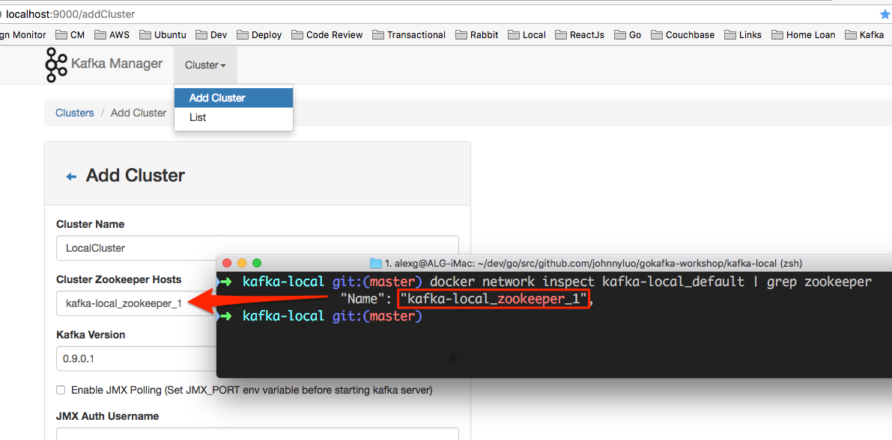

# gokafka-workshop

This is a talk about golang and kafka prepared for the golang sydney meetup , run the following command to get everything

```bash
go get -u github.com/johnnyluo/gokafka-workshop
```

* Please install latest golang, refer to [Getting Started](https://golang.org/doc/install)
* We will be running a one node kafka in docker composer on your local machine, if you don't have docker composer setup , please follow [Install Docker Compose](https://docs.docker.com/compose/install/) , to set it up.

You will need the following libraries in this workshop
* github.com/Shopify/sarama
```bash
go get -u github.com/Shopify/sarama
```
* github.com/bsm/sarama-cluster
```bash
go get -u github.com/bsm/sarama-cluster
```

# Run kafka in docker
* open a terminal
* go to kafka-local folder
```bash
docker-compose up -d
```
If you are comfortable to cli tools, then you can go [here](http://kafka.apache.org/downloads.html) , otherwise follow the following steps to setup your local Kafka manager through the UI.

# setup kafka manager
* Open a browser  , go to `http://localhost:9000`
* You should see a screen like this

* Click Cluster->Add Cluster

* Click "Save" button

* Add topic


